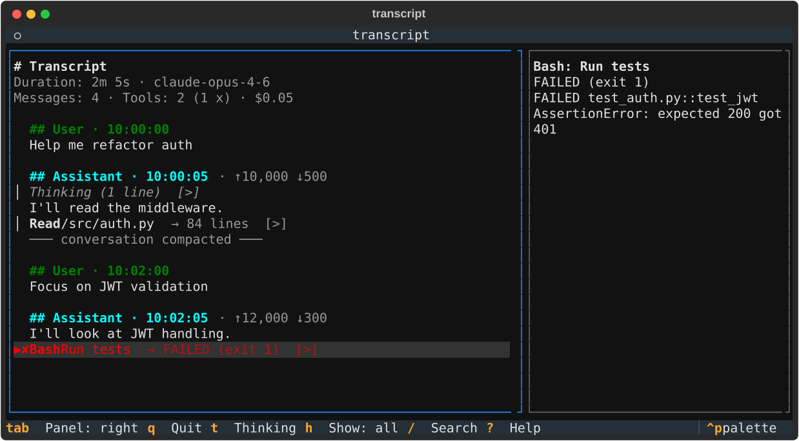

# transcript

[](https://github.com/glebmish/transcript/actions/workflows/ci.yml)
[](https://github.com/glebmish/transcript/releases)
[](LICENSE)

Turn a Claude Code, Gemini CLI or Codex session log into a readable Markdown transcript, or browse it in a terminal UI.

Agent session logs are raw JSON or JSONL, with thinking, tool calls and tool output split across separate entries. `transcript` reassembles them into the conversation as it happened: every user message, thinking block, tool call with its result, token count and estimated cost. It is for people who use these agents and want to review, debug or share what a session actually did. Nothing is filtered out by default, and terminal control characters in the log are shown as visible symbols such as `␛`, never executed.



```bash
pipx install git+https://github.com/glebmish/transcript@v0.1.2
transcript ~/.claude/projects/<project>/<session>.jsonl   # Markdown to stdout
transcript view ~/.claude/projects/<project>/<session>.jsonl   # terminal UI
```

## Install

Requires Python 3.12+. Tested in CI on Linux and macOS; Windows is untested. `transcript` is distributed from GitHub only; it is not on PyPI.

Install from the release tag:

```bash
pipx install git+https://github.com/glebmish/transcript@v0.1.2
# or
uv tool install git+https://github.com/glebmish/transcript@v0.1.2
# or, inside a virtualenv
pip install git+https://github.com/glebmish/transcript@v0.1.2
```

Or install the wheel attached to the [GitHub release](https://github.com/glebmish/transcript/releases/tag/v0.1.2):

```bash
pipx install https://github.com/glebmish/transcript/releases/download/v0.1.2/transcript-0.1.2-py3-none-any.whl
# or
uv tool install https://github.com/glebmish/transcript/releases/download/v0.1.2/transcript-0.1.2-py3-none-any.whl
```

If pipx's default Python is older than 3.12, add `--python python3.12`. To work from a checkout, see [CONTRIBUTING.md](CONTRIBUTING.md).

Check the install:

```console
$ transcript --version
transcript 0.1.2
```

## Markdown output

```bash
transcript session.jsonl                       # print to stdout; the format is auto-detected
transcript -o review.md session.jsonl          # write to a file
transcript --pretty session.jsonl              # render the Markdown in the terminal
transcript --expand-tools session.jsonl        # include full tool output, untruncated
transcript --no-thinking --no-text session.jsonl   # tool calls only: what did the agent do?
transcript --format codex session.jsonl        # skip auto-detection
```

Output for the test fixture `tests/fixtures/claude_minimal.jsonl`:

```markdown
# Transcript

- **Duration**: 2m 5s (2026-01-01 10:00:00 → 2026-01-01 10:02:05)
- **Model(s)**: claude-opus-4-6
- **Messages**: 4 (2 user, 2 assistant)
- **Tool calls**: 2 (1 passed, 1 failed)
- **Tokens**: ↑22,000 ↓800 · $0.05

---

## User · 2026-01-01 10:00:00

Help me refactor auth


---

## Assistant · 2026-01-01 10:00:05 · ↑10,000 ↓500 · $0.03

> Let me look at auth code.

I'll read the middleware.

`Read: /src/auth.py → 84 lines`


--- conversation compacted ---

---

## User · 2026-01-01 10:02:00

Focus on JWT validation


---

## Assistant · 2026-01-01 10:02:05 · ↑12,000 ↓300 · $0.03

I'll look at JWT handling.

`Bash: Run tests → FAILED (exit 1)`
```

`↑` is input tokens (including cached), `↓` is output tokens. Thinking is quoted with `>`. Each tool call is one line, `name: summary → result`; `--expand-tools` adds the full output under it:

````markdown
x Bash: Run tests → FAILED (exit 1)

```
FAILED test_auth.py::test_jwt
AssertionError: expected 200 got 401
```
````

Expanded tool lines are prefixed `x ` when the call failed, `~ ` when it was cancelled, and two spaces otherwise.

### Options

| Option | Effect |
|--------|--------|
| `-f`, `--format {claude,gemini,codex}` | Log format; auto-detected if omitted |
| `-o`, `--output FILE` | Write to a file instead of stdout |
| `--no-thinking` | Leave out thinking blocks |
| `--no-tools` | Leave out tool calls |
| `--no-text` | Leave out message text, user and assistant |
| `--no-cost` | Leave out token counts and cost |
| `--expand-tools` | Show full tool output |
| `--pretty` | Render the Markdown in the terminal |
| `--version` | Print the version |

The `--no-*` flags remove content but keep the structure: every message heading is still printed.

## Terminal UI

```bash
transcript view session.jsonl
```

`view` accepts the same `--format` option. The conversation is on the left; press Enter on a tool call to open it in the detail panel on the right. The screenshot at the top of this page shows the failed `Bash` call opened this way.

| Key | Action |
|-----|--------|
| `j`/`k`, Up/Down | Move between rows; scroll when the detail panel is focused |
| `Enter` | Open the focused tool call in the detail panel. On a thinking block, the first press expands it and the second opens it in the panel |
| `t` | Expand or collapse all thinking blocks |
| `h` | Cycle what is shown: all → messages only → user + tools → all |
| `/` | Search (case-insensitive); Enter jumps to the first match |
| `n` / `N` | Next / previous search match |
| `Tab` | Switch focus between the panels |
| `Esc` | Close the search bar, or clear the detail panel |
| `?` | Show the keybindings |
| `q`, Ctrl+C | Quit |

"Messages only" hides thinking and tool calls. "User + tools" shows user messages and tool calls, without assistant text.

## Log locations

| Agent | Path | Format |
|-------|------|--------|
| Claude Code | `~/.claude/projects/<project>/<session>.jsonl` | JSONL |
| Gemini CLI | `~/.gemini/tmp/<hash>/chats/session-*.json` | JSON |
| Codex CLI/Desktop | `~/.codex/sessions/YYYY/MM/DD/rollout-*.jsonl` | JSONL |

(Claude Code's `<project>` folder is the project's path with every character other than a letter or digit replaced by `-`, for example `-Users-me-src-app` for `/Users/me/src/app`.)

The format is auto-detected. Use `--format claude`, `--format gemini` or `--format codex` to override it.

## Cost estimation

Costs are estimates from a built-in price table (USD per 1M tokens, prices checked 2026-10-06). Cache tokens are priced the way each provider bills them. For Anthropic models, cache writes cost 1.25× the input price with the 5-minute TTL and 2× with the 1-hour TTL, and cache reads cost 0.1× input, except the lower read rates for `claude-fable-5-1` and `claude-opus-5-5` shown below. Gemini 2.5 bills cached input at 0.1× input and has no cache-write charge, because Gemini CLI relies on implicit caching.

| Model | Input | Output | Cache read | Cache write (5m) | Cache write (1h) |
|-------|------:|-------:|-----------:|-----------------:|-----------------:|
| claude-fable-5-1 | $10.00 | $50.00 | $0.25 | $12.50 | $20.00 |
| claude-fable-5 | $10.00 | $50.00 | $1.00 | $12.50 | $20.00 |
| claude-opus-5-5 | $4.00 | $20.00 | $0.20 | $5.00 | $8.00 |
| claude-opus-5 | $5.00 | $25.00 | $0.50 | $6.25 | $10.00 |
| claude-opus-4-8 | $5.00 | $25.00 | $0.50 | $6.25 | $10.00 |
| claude-opus-4-7 | $5.00 | $25.00 | $0.50 | $6.25 | $10.00 |
| claude-opus-4-6 | $5.00 | $25.00 | $0.50 | $6.25 | $10.00 |
| claude-opus-4-5 | $5.00 | $25.00 | $0.50 | $6.25 | $10.00 |
| claude-opus-4-1 | $15.00 | $75.00 | $1.50 | $18.75 | $30.00 |
| claude-opus-4-0 (`claude-opus-4-20250514`) | $15.00 | $75.00 | $1.50 | $18.75 | $30.00 |
| claude-sonnet-5-5 | $2.00 | $10.00 | $0.20 | $2.50 | $4.00 |
| claude-sonnet-5 | $2.00 | $10.00 | $0.20 | $2.50 | $4.00 |
| claude-sonnet-4-6 | $3.00 | $15.00 | $0.30 | $3.75 | $6.00 |
| claude-sonnet-4-5 | $3.00 | $15.00 | $0.30 | $3.75 | $6.00 |
| claude-sonnet-4-0 (`claude-sonnet-4-20250514`) | $3.00 | $15.00 | $0.30 | $3.75 | $6.00 |
| claude-haiku-4-5 | $1.00 | $5.00 | $0.10 | $1.25 | $2.00 |
| gemini-2.5-pro | $1.25 | $10.00 | $0.125 | — | — |
| gemini-2.5-flash | $0.30 | $2.50 | $0.03 | — | — |
| gemini-2.5-flash-lite | $0.10 | $0.40 | $0.01 | — | — |

A model id uses the longest table entry it starts with, so `claude-sonnet-4-5-20250929` gets the `claude-sonnet-4-5` price, and `gemini-2.5-flash-lite` is not priced as `gemini-2.5-flash`.

Models not in the table show cost as `$?`, or as `(partial)` when only some messages could be priced. That includes all OpenAI/Codex models: Codex transcripts show tokens but no cost.

## Limitations

- One log file per run. There is no session browser or search across sessions; find the file yourself (see [Log locations](#log-locations)).
- The three log formats are undocumented internals of each agent. A new agent version can change them, and `transcript` will lag until its parser is updated.
- Prices are a static table. They are not fetched, and new models show `$?` until the table is updated.
- `gemini-2.5-pro` is priced at the tier for prompts up to 200k tokens; the higher long-prompt tier is not modeled, so very long prompts are underestimated.
- Gemini explicit-cache storage fees are not modeled. Gemini CLI logs only show implicit caching.

## Documentation

- [docs/specs/](docs/specs/README.md): how each log format is parsed and how each piece is rendered. These are kept in sync with the code.
- [CONTRIBUTING.md](CONTRIBUTING.md): dev setup, tests, and the checklist for adding a new log format.
- [SECURITY.md](SECURITY.md): threat model and how to report a vulnerability.
- [Releases](https://github.com/glebmish/transcript/releases): changes in each version.

## License

[MIT](LICENSE).

`transcript` is an independent project. It is not affiliated with or endorsed by Anthropic, Google or OpenAI. Claude, Gemini and Codex are named only to describe the log formats it reads.
